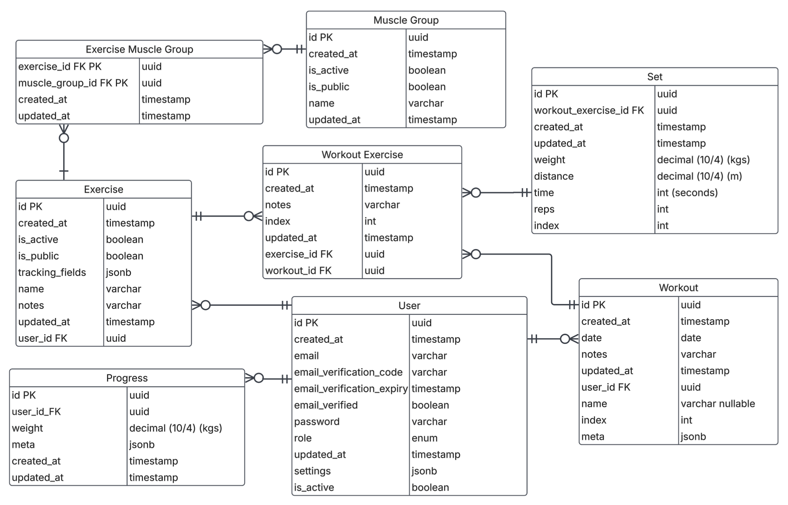

# Fitlog

## Backend

MVP plan for structure:

controllers:
- HealthController 
  - single endpoint for api healthcheck
- ExerciseController
  - primary entities: exercise, exercise muscle group, muscle group
  - concerns:
    - managing available exercises
    - linking muscle groups to exercises
- MuscleGroupController
  - primary entities: muscle group
    - managing muscle group creation / deletion / edits
- WorkoutController
  - primary entities: workout, workout exercise, set
  - concerns:
    - creating workouts, adding exercises to the workout
    - adding sets to a workout_exercies
    - ordering of workouts and sets
- UserController
  - primary entities: user, progress
  - concerns:
    - user settings
    - user progress
- AuthController
  - primary entities: user
  - concerns:
    - auth, login refresh token, create account
    - reset password, email verification

Repositories:
- UserRepository
- WorkoutRepository
- ExerciseRepository
- MuscleGroupRepository
- ProgressRepository
Entities:
- User
- Workout
- WorkoutExercise
- Set
- Exercise
- MuscleGroup
- Progress
Controllers:
- HealthController 
- ExerciseController
- MuscleGroupController
- WorkoutController
- UserController
- AuthController
Services: 
- ExerciseService
- MuscleGroupService
- WorkoutService
- UserService
- AuthService
- EmailService

## DB
DB plan:

